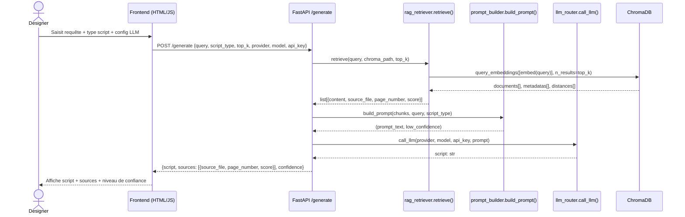

# Architecture Technique — CATScript-AI

**Projet :** CATScript-AI | **Codename :** FastCAD
**Version :** 0.1.0 — Phase 1 PoC
**Dernière mise à jour :** 2026-06-05

---

## 1. Stack Technique

| Couche | Outil | Version | Rôle |
|---|---|---|---|
| Serveur HTTP | FastAPI | ≥ 0.111.0 | Point d'entrée API REST ; routage, validation, CORS |
| Serveur ASGI | Uvicorn (standard) | ≥ 0.29.0 | Serveur ASGI pour FastAPI |
| Extraction PDF — primaire | pdfplumber | ≥ 0.11.0 | Extraction texte page par page (mise en page préservée) |
| Extraction PDF — fallback | PyMuPDF (fitz) | ≥ 1.24.0 | Fallback quand pdfplumber retourne du texte vide |
| Découpage texte | langchain-text-splitters (`RecursiveCharacterTextSplitter`) | ≥ 0.2.0 | Découpage en chunks de 500 caractères, overlap 50 |
| Embeddings | sentence-transformers (`all-MiniLM-L6-v2`) | ≥ 3.0.0 | Vectorisation des chunks et des requêtes (local, sans API) |
| Base vectorielle | ChromaDB (PersistentClient) | ≥ 0.5.0 | Stockage et recherche de similarité ; persistance fichier locale |
| LLM — Anthropic | anthropic SDK | ≥ 0.28.0 | Appel Claude (ex. claude-3-5-sonnet) ; max_tokens = 4096 |
| LLM — Google | google-generativeai | ≥ 0.7.0 | Appel Gemini (ex. gemini-2.0-flash) |
| LLM — OpenAI | openai SDK | ≥ 1.30.0 | Appel GPT-4o / GPT-4 Turbo |
| LLM — Ollama | ollama SDK | ≥ 0.2.0 | Appel modèles locaux via `localhost:11434` |
| Validation données | Pydantic | ≥ 2.7.0 | Schémas de requête/réponse ; enums strict |
| Upload multipart | python-multipart | ≥ 0.0.9 | Parsing form-data si nécessaire |
| Frontend | HTML/CSS/JS pur | — | UI statique servie par FastAPI (`/static`) |
| Stockage configuration LLM | `localStorage` navigateur | — | Clé API, provider, modèle — jamais persisté côté serveur |

---

## 2. Décomposition Fonctionnelle

### 2.1 `backend/main.py` — Point d'entrée applicatif

**Fichier :** `backend/main.py`

**Responsabilité :** Instancie l'application FastAPI, configure le middleware CORS, monte le routeur API et sert le frontend statique.

**Interface publique :**

```python
app: FastAPI  # instance ASGI — importée par uvicorn

@app.get("/")
def serve_ui() -> FileResponse
# Retourne frontend/index.html
```

**Détails :**
- CORS restreint à `http://localhost:8000` et `http://127.0.0.1:8000`.
- Méthodes autorisées : `GET`, `POST`.
- Répertoire statique monté sur `/static` → `frontend/`.

---

### 2.2 `backend/routes.py` — Endpoints et schémas Pydantic

**Fichier :** `backend/routes.py`

**Responsabilité :** Définit les schémas de validation (Pydantic v2) et les deux endpoints HTTP. Orchestre le pipeline RAG + LLM pour chaque requête de génération.

**Interface publique :**

```python
router: APIRouter  # monté sur app dans main.py

@router.get("/health")
def health() -> dict
# Retourne {"status": "ok"}

@router.post("/generate", response_model=GenerationResponse)
def generate(req: GenerationRequest) -> GenerationResponse
# Orchestre : retrieve → build_prompt → call_llm → calcul confidence → réponse
```

**Logique de calcul du niveau de confiance :**

| Condition | Niveau retourné |
|---|---|
| `low_confidence` flagué par `build_prompt` | `low` |
| `max_score >= 0.7` | `high` |
| Autre | `medium` |

---

### 2.3 `backend/ingest.py` — Pipeline d'ingestion PDF

**Fichier :** `backend/ingest.py`

**Responsabilité :** Charge les PDFs, découpe le texte en chunks, vectorise et persiste dans ChromaDB. Exécutable en CLI (`python -m backend.ingest --docs <dossier>`).

**Interface publique :**

```python
def load_pdf(path: Path) -> list[dict]
# Extrait le texte de chaque page.
# Primaire : pdfplumber. Fallback par page : fitz si texte vide.
# Retourne : list[{page_number: int, text: str, source_file: str}]

def chunk_pages(pages: list[dict]) -> list[dict]
# Découpe les textes de page en chunks overlappés via RecursiveCharacterTextSplitter.
# chunk_size=500, chunk_overlap=50.
# Retourne : list[{chunk_id: str (UUID4), source_file: str, page_number: int, content: str}]

def embed_and_store(chunks: list[dict], chroma_path: Path) -> int
# Vectorise les nouveaux chunks (all-MiniLM-L6-v2) et les stocke dans ChromaDB.
# Idempotent : les chunk_id déjà présents sont ignorés silencieusement.
# Retourne : nombre de chunks effectivement ajoutés.
```

**Constantes internes :**

```python
_COLLECTION_NAME = "catscript_knowhow"
_EMBED_MODEL     = "all-MiniLM-L6-v2"
_SPLITTER        = RecursiveCharacterTextSplitter(chunk_size=500, chunk_overlap=50)
```

---

### 2.4 `backend/rag_retriever.py` — Recherche vectorielle

**Fichier :** `backend/rag_retriever.py`

**Responsabilité :** Vectorise la requête utilisateur et interroge ChromaDB pour retourner les chunks les plus pertinents. Partage le modèle d'embedding avec `ingest.py` (même constantes importées). Instance du modèle mise en cache au niveau module (singleton `_model`).

**Interface publique :**

```python
def retrieve(
    query: str,
    chroma_path: Path,
    top_k: int = 5,
) -> list[dict]
# Encode la requête, interroge la collection ChromaDB, convertit les distances en scores.
# score = round(1.0 - distance, 4)   (distance cosinus ChromaDB ∈ [0, 2])
# Retourne : list[{content: str, source_file: str, page_number: int, score: float}]
# Ordre : score décroissant (résultat natif ChromaDB).
```

**Note :** `n_results` est borné à `min(top_k, collection.count() or 1)` pour éviter une erreur si la collection contient moins de chunks que `top_k`.

---

### 2.5 `backend/prompt_builder.py` — Construction du prompt LLM

**Fichier :** `backend/prompt_builder.py`

**Responsabilité :** Assemble le prompt final à partir des chunks récupérés et de la requête utilisateur. Évalue le signal de faible confiance.

**Interface publique :**

```python
LOW_CONFIDENCE_THRESHOLD: float = 0.3

def build_prompt(
    retrieved_chunks: list[dict],
    user_query: str,
    script_type: str,
) -> tuple[str, bool]
# Construit le prompt à partir du template _SYSTEM_TEMPLATE.
# low_confidence = True si aucun chunk ou max(score) < 0.3.
# Chaque chunk est formaté : "[N] <source_file> p.<page>\n<content>"
# Si aucun chunk : context = "(No relevant know-how found in the document corpus.)"
# Retourne : (prompt_text: str, low_confidence: bool)
```

**Template de prompt (verbatim) :**

```
You are an expert CATIA V5 R27 automation engineer.
You generate syntactically correct {script_type} scripts.
You ONLY use the know-how context provided below.
If the context is insufficient, say so explicitly before generating.
Always add inline comments to explain each step.

KNOW-HOW CONTEXT:
{context}

USER REQUEST:
{user_query}

Generate the script now.
```

---

### 2.6 `backend/llm_router.py` — Routeur LLM multi-provider

**Fichier :** `backend/llm_router.py`

**Responsabilité :** Abstraction provider-agnostique. Achemine le prompt vers le SDK approprié selon le paramètre `provider`. Importe les SDKs à la demande (import lazy).

**Interface publique :**

```python
def call_llm(
    provider: str,   # 'anthropic' | 'google' | 'openai' | 'ollama'
    model: str,      # nom du modèle tel que spécifié par l'utilisateur
    api_key: str,    # clé API (ignorée pour 'ollama')
    prompt: str,     # prompt complet assemblé par build_prompt()
) -> str
# Retourne le texte généré par le LLM.
# Lève ValueError si le provider n'est pas supporté.
```

**Comportement par provider :**

| Provider | SDK utilisé | `max_tokens` | Point d'entrée |
|---|---|---|---|
| `anthropic` | `anthropic.Anthropic` | 4096 | `client.messages.create(...)` |
| `google` | `google.generativeai` | — (défaut SDK) | `GenerativeModel(model).generate_content(prompt).text` |
| `openai` | `openai.OpenAI` | — (défaut SDK) | `chat.completions.create(...).choices[0].message.content` |
| `ollama` | `ollama` | — (défaut SDK) | `ollama.chat(...)[\"message\"][\"content\"]` |

---

## 3. Interactions Applicatives

### 3.1 Séquence — Requête utilisateur → `/generate` → LLM → Réponse



---

### 3.2 Flux — Pipeline d'ingestion PDF → ChromaDB

```mermaid
flowchart TD
    A[Dossier PDF<br/>data/pdf_docs/] --> B[load_pdf<br/>ingest.py]

    subgraph load_pdf["load_pdf() — T-101"]
        B1[pdfplumber : extract_text par page]
        B2{Texte vide ?}
        B3[fitz fallback : get_text]
        B1 --> B2
        B2 -- Oui --> B3
        B2 -- Non --> B4[page dict<br/>{page_number, text, source_file}]
        B3 --> B4
    end

    B --> load_pdf
    load_pdf --> C[chunk_pages<br/>ingest.py]

    subgraph chunk_pages["chunk_pages() — T-102"]
        C1[RecursiveCharacterTextSplitter<br/>chunk_size=500, overlap=50]
        C2[chunk dict<br/>{chunk_id UUID4, source_file, page_number, content}]
        C1 --> C2
    end

    C --> chunk_pages
    chunk_pages --> D[embed_and_store<br/>ingest.py]

    subgraph embed_and_store["embed_and_store() — T-103"]
        D1[ChromaDB : get existing IDs]
        D2{chunk_id déjà présent ?}
        D3[SentenceTransformer<br/>all-MiniLM-L6-v2<br/>encode chunks]
        D4[collection.add<br/>ids, embeddings, documents, metadatas]
        D5[Skip silencieux]
        D1 --> D2
        D2 -- Non --> D3
        D2 -- Oui --> D5
        D3 --> D4
    end

    D --> embed_and_store
    embed_and_store --> E[(ChromaDB<br/>data/chroma_db/<br/>collection: catscript_knowhow)]
```

---

## 4. Modèle de Données

### 4.1 Schémas Pydantic (`backend/routes.py`)

#### Enums

```python
class ScriptType(str, Enum):
    catscript = "catscript"   # Macros CATScript / VBA CATIA V5
    ekl       = "ekl"         # Engineering Knowledge Language
    ehi_eha   = "ehi_eha"     # Electrical Harness Installation / Assembly

class Provider(str, Enum):
    anthropic = "anthropic"
    google    = "google"
    openai    = "openai"
    ollama    = "ollama"

class ConfidenceLevel(str, Enum):
    high   = "high"    # max(score) >= 0.7
    medium = "medium"  # max(score) < 0.7 et >= LOW_CONFIDENCE_THRESHOLD
    low    = "low"     # max(score) < LOW_CONFIDENCE_THRESHOLD (0.3) ou aucun chunk
```

#### `GenerationRequest`

```python
class GenerationRequest(BaseModel):
    query:       str         # Field(..., min_length=1) — description langage naturel
    script_type: ScriptType  # type de script cible
    top_k:       int         # Field(default=5, ge=1, le=20) — nb chunks à récupérer
    provider:    Provider    # provider LLM sélectionné
    model:       str         # Field(..., min_length=1) — ID du modèle
    api_key:     str         # Field(default="") — clé API ; ignorée si ollama
```

#### `SourceRef`

```python
class SourceRef(BaseModel):
    source_file: str    # nom du fichier PDF source
    page_number: int    # numéro de page dans le PDF (1-indexé)
    score:       float  # score de similarité ∈ [0, 1] (1.0 - distance ChromaDB)
```

#### `GenerationResponse`

```python
class GenerationResponse(BaseModel):
    script:     str                 # texte du script généré par le LLM
    sources:    list[SourceRef]     # références des chunks utilisés pour le contexte
    confidence: ConfidenceLevel     # niveau de confiance calculé depuis les scores
```

---

### 4.2 Schéma chunk ChromaDB

Stocké dans la collection `catscript_knowhow` via `chromadb.PersistentClient`.

| Champ ChromaDB | Type | Valeur |
|---|---|---|
| `id` | `str` | `chunk_id` — UUID4 généré à l'ingestion |
| `embedding` | `list[float]` | Vecteur `all-MiniLM-L6-v2` (dim 384) |
| `document` | `str` | Contenu textuel du chunk (`content`) |
| `metadata.source_file` | `str` | Nom du fichier PDF d'origine |
| `metadata.page_number` | `int` | Numéro de page dans le PDF (1-indexé) |

**Chemin de persistance :** `<project_root>/data/chroma_db/`

---

### 4.3 Schéma page (output de `load_pdf`)

Produit par `ingest.load_pdf()`, consommé par `ingest.chunk_pages()`.

```python
{
    "page_number": int,    # numéro de page 1-indexé
    "text":        str,    # texte extrait (pdfplumber ou fitz)
    "source_file": str,    # Path.name du fichier PDF
}
```

---

### 4.4 Schéma chunk interne (output de `chunk_pages`)

Produit par `ingest.chunk_pages()`, consommé par `ingest.embed_and_store()`.

```python
{
    "chunk_id":    str,    # UUID4 (str(uuid.uuid4()))
    "source_file": str,    # hérité de la page parente
    "page_number": int,    # hérité de la page parente
    "content":     str,    # segment textuel découpé par RecursiveCharacterTextSplitter
}
```

---

### 4.5 Schéma chunk récupéré (output de `retrieve`)

Produit par `rag_retriever.retrieve()`, consommé par `routes.generate()` et `prompt_builder.build_prompt()`.

```python
{
    "content":     str,    # texte du chunk (document ChromaDB)
    "source_file": str,    # metadata.source_file
    "page_number": int,    # metadata.page_number
    "score":       float,  # round(1.0 - distance, 4) — similarité cosinus normalisée
}
```

---

*Fin du document — v0.1.0*
